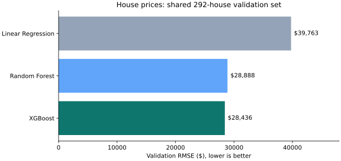

# Housing Price Predictor

A machine learning project that predicts house sale prices from five property features and compares Linear Regression, Random Forest, and XGBoost. It uses the Kaggle House Prices dataset, with a shared validation split and consistent preprocessing for every model.

Built with Python, pandas, scikit-learn, XGBoost, and Matplotlib. Available as a command-line program and a Jupyter notebook.

## Results



| Model | Validation RMSE |
| --- | ---: |
| Linear Regression | $39,763.30 |
| Random Forest | $28,887.96 |
| XGBoost | **$28,436.04** |

RMSE measures prediction error in dollars and gives larger errors more weight. Lower is better; it is not percentage accuracy.

The comparison uses 1,168 fitting rows and 292 validation rows. XGBoost had the lowest validation RMSE and was then refitted on all 1,460 labeled houses to generate 1,459 predictions.

Browse the [saved metrics](results/metrics.json), [10 sample predictions](results/sample_predictions.csv), or [notebook](housing_price_predictor.ipynb). The samples are predictions for the unlabeled test set, not known sale prices. These files can be inspected without installing the project.

## Method

The model uses these five numeric inputs:

| Feature | Description |
| --- | --- |
| `GrLivArea` | Above-ground living area in square feet |
| `OverallQual` | Overall material and finish quality rating |
| `TotalBsmtSF` | Total basement area in square feet |
| `GarageCars` | Garage capacity in cars |
| `YearBuilt` | Original construction year |

1. Split the labeled data into 80% fitting rows and 20% validation rows, with random seed 42.
2. Fit a median imputer and regressor together in a separate pipeline for each candidate. Medians are learned only from the fitting rows, keeping validation data out of training.
3. Evaluate all candidates on the same validation rows using dollar-scale RMSE.
4. Select the lowest-RMSE model, copy its pipeline, and refit both preprocessing and regression on all labeled rows.
5. Apply the final pipeline to the test data and export `Id` and `SalePrice` predictions.

Random Forest and XGBoost each use 100 estimators; XGBoost uses a learning rate of 0.1. Both use random seed 42 and one worker.

## Setup

Tested with **Python 3.12** on Linux. Direct dependencies are pinned in `requirements.txt`.

```bash
git clone https://github.com/Sarim-h191/housing-price-predictor.git
cd housing-price-predictor
python3.12 -m venv .venv
source .venv/bin/activate
python -m pip install -r requirements.txt
```

On Windows PowerShell, create the environment with `py -3.12 -m venv .venv` and activate it with `.venv\Scripts\Activate.ps1`. macOS and Windows have not been independently tested. If XGBoost on macOS reports a missing `libomp` library, install the OpenMP runtime through your package manager before retrying.

### Get the data

Download `train.csv` and `test.csv` from the [Kaggle House Prices data page](https://www.kaggle.com/competitions/house-prices-advanced-regression-techniques/data). Sign in and accept the competition rules if prompted. Extract the download and place both files inside a folder named `data` in the repository root.

The source dataset is not included in this repository. The saved results use the dataset fingerprints recorded in [verification notes](REPAIR_RESULTS.md).

### Run the prediction workflow

From the repository root, with the virtual environment active:

```bash
python housing.py --data-dir data --output-dir outputs
```

The terminal prints model scores and the selected model. The program creates:

| File | Contents |
| --- | --- |
| `outputs/metrics.json` | Validation scores, selected model, and row counts |
| `outputs/submission.csv` | One predicted sale price per test-set ID |

The paths can be changed with `--data-dir` and `--output-dir`. Missing CSV files produce an explanatory error. Rerunning overwrites the two output files in the selected output directory.

### Run the notebook

```bash
jupyter lab housing_price_predictor.ipynb
```

Select the Python kernel from the active environment and run the cells from top to bottom. The notebook uses the same `housing.py` workflow and adds model-comparison and actual-versus-predicted plots. Update `DATA_DIR` in the first code cell if the CSV files are stored elsewhere.

## Tests

```bash
python -m unittest -v
```

The tests use synthetic data and require no Kaggle download. They check that validation rows do not influence fitted medians, the final pipeline refits on all labeled rows, predictions use consistent preprocessing, IDs are preserved, repeated runs agree, and invalid inputs are rejected. See [verification notes](REPAIR_RESULTS.md) for the real-data execution results.

## Scope and limitations

- This is an offline regression project, not a deployed appraisal service.
- The same holdout is used to select the model, so its RMSE is a validation result rather than an independent final test score.
- Kaggle's test prices are unavailable locally. No leaderboard score is claimed, and the dollar-scale RMSE here differs from the competition's log-price metric.
- The model uses five features with fixed settings. Cross-validation, hyperparameter search, and feature-importance analysis are outside this version's scope.
- Results describe this dataset and split; they do not establish performance on current housing markets or other locations.
